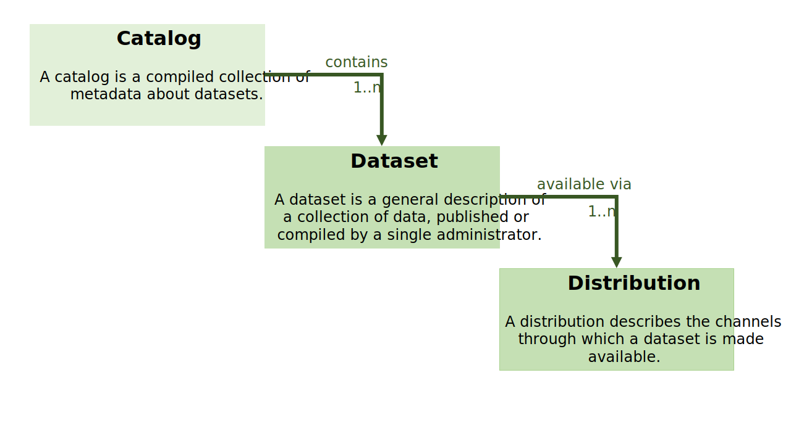

# Preface
  
## Context 
  
To increase the findability of datasets of heritage institutions, it is important to publish the dataset descriptions according to a well documented, machine-readable model. When rich dataset descriptions are used, published not only as HTML (for humans) but also as meaningful metadata (for the machine), the findability and use of datasets that heritage institutions make available, will improve.
  
This document describes a publication model for dataset descriptions that is advised to Dutch heritage institutions that want to make their datasets easier to find.
  
## Scope  
  
The presented publication model is explicitly about the model to be used for online publication of dataset descriptions. Storage of dataset descriptions (within a collection registration system, register or aggregator) _can_ be based on this model, but is not required. Furthermore, the publication model does not dictate the format of the datasets themselves.
  
## Approach
The publication model is based on the [conceptual model of the NDE Register](https://www.netwerkdigitaalerfgoed.nl/wp-content/uploads/2019/04/NDE-Register_-conceptueel-datamodel.pdf) (in Dutch). Added to this, is the knowledge about available dataset descriptions currently in use.
  
Two RDF vocabularies have been assessed that can give substance to the conceptual model: DCAT and schema.org/Dataset. This also applies to the _serialization_ of the dataset descriptions, here too, some forms are advised.
   
  
# Model selection
  
## User first
 
The strategic goal of putting the user first also has implications with regard to the provision of datasets and dataset descriptions. The user of datasets and dataset descriptions is not an end user, but a person or organization that wants to reuse the datasets and dataset descriptions for its own purposes. This can be a scientist who wants to interpret migration patterns, a portal that presents a certain type of heritage information, or a commercial company that uses the data in its own products or services. These kind of users are often more technically oriented and use standard or custom tools to process the dataset descriptions and datasets programatically.
  
When (re)using datasets it is important to know:  
- what a dataset is called and how it is (uniquely and permanently) identified;
- what kind of data is in the dataset;
- according to which standard the information is stored and made available;
- which organization publishes the dataset (the "owner");
- in which language the data is written (Dutch, Frisian, English);
- what you are allowed to do with the dataset (license);
- how the dataset can be obtained (eg. URL of the file to be downloaded or API to be consulted);
- who is the point of contact (content and technical) for the dataset;
- where more (substantive and technical) information can be found about the dataset;
- when this dataset has been published (and last updated or version).

When the dataset description is offered not only in Dutch, but also in other languages, the reach becomes even greater!

A model for data set descriptions, based on the above information need and the [conceptual model of the NDE Register](https://www.netwerkdigitaalerfgoed.nl/wp-content/uploads/2019/04/NDE-Register_-conceptueel-datamodel.pdf) (in Dutch), will help.
  
## Main entities
The publication model has three main entities:
  
- the **data catalog** contains one or more datasets
- the **dataset**  contains one or more distributions
- the **distribution** describes the way the data can be downloaded,  as a file download in a specific format or an API like SPARQL or OAI-PMH.

  
  
## DCAT  

DCAT (Data Catalog Vocabulary) is an RDF vocabulary designed to facilitate interoperability between data catalogs published on the web. [DCAT](http://www.w3.org/TR/2014/REC-vocab-dcat-20140116/) is a W3C Recommendation.
  
Often an application profile is made, based on the DCAT model. In this application profile choices are made which (entities and) attributes from the DCAT model are to be used and an interpretation of the value range of the attributes is given (often with value lists).
  
The European application profile of DCAT is [DCAT-AP-EU v1.1](https://joinup.ec.europa.eu/asset/dcat_application_profile/asset_release/dcat-ap-v11). Derived from this, for use on open data portals of the Dutch government, was [DCAT-AP-NL](https://dcat-ap-nl.readthedocs.io/). This application profile has been drawn up and is managed by the Knowledge and Exploitation Center for Official Publications (KOOP) of the Dutch Ministry of the Interior and Kingdom Relations (BZK).
    
## Schema.org  
 
Schema.org is a joint initiative of three major search engines: Bing, Google and Yahoo with the aim of setting up a shared scheme to structure data. Vocabularies from [schema.org](https://schema.org) are developed through an open community process.
  
For datasets, the class [https://schema.org/Dataset](https://schema.org/Dataset) has been developed. This class is based on W3C DCAT work and benefits from collaboration around the DCAT, ADMS and VoID vocabularies.
   
The [https://schema.org/Dataset](https://schema.org/Dataset) class, together with the [https://schema.org/DataCatalog](https://schema.org/DataCatalog) and  [https://schema.org/DataDownload](https://schema.org/DataDownload), offer a rich model to describe datasets.  
  
## Considerations
  
When choosing a preferred model for dataset descriptions, the following aspects were considered:  
- Model at least implements the conceptual model
- Is an open and managed model
- Has a positive impact on findability
- Has a high adoption rate

Both DCAT and https://schema.org/Dataset offer a model which match the conceptual model for dataset descriptions.
  
Both DCAT and schema.org are open models within a managed environment.

Schema.org has better support from search engines such as Google Dataset Search. Although [Google's documentation](https://developers.google.com/search/docs/data-types/dataset) states that both schema.org and "equivalent structures represented in W3C's Data Catalog Vocabulary (DCAT) format" are supported, experiments indicate that schema.org includes datasets and DCAT descriptions do not.

Probably because of the push by search engines, there is wide adoption of schema.org. To take the Dutch government's data portal as an example: the machine-readable data description at [https://data.overheid.nl/dataset/monumentenkaart-utrecht](https://data.overheid.nl/dataset/monumentenkaart-utrecht) uses schema.org.
 
NB 1: where schema.org is used for publication, DCAT is used 'internally' by data.overheid.nl, there is a mapping from DCAT to schema.org. The RDF variant of a dataset description (according to DCAT-AP-NL) can be retrieved by appending /rdf to the URL, for example [https://data.overheid.nl/dataset/monumentenkaart-utrecht/rdf](https://data.overheid.nl/dataset/monumentenkaart-utrecht/rdf). 

NB 2: see [DCAT-AP to Schema.org Mapping](https://ec-jrc.github.io/dcat-ap-to-schema-org/#mapping-classes) to see the richness of both models and likeness (mapping) of classes and properties.

**Based on the considerations above, preference is given to publication of dataset descriptions according to the schema.org/Dataset model. Use of this model entails better findability by search engines.**
  
# Publication model
  
The properties to be used per class are listed below, together referred to as the publication model. For each property it is indicated in the "Obligation" column, whether the property is mandatory (so must be present in the description) or recommended, optional properties are not included. For readability, the "https://schema.org/" part of the property is displayed as "schema:" in the tables below. Follow the provided links to see more information about the property on the schema.org website.
  
## Data catalog - [schema:DataCatalog](http://schema.org/DataCatalog)  
The use of a data catalog (a collection of datasets) is not mandatory, but recommended, because it contributes to findability. 
  
| **Property** | **Obligation** | **Usage** |  
|:---|:---|:---:|  
| [schema:name](https://schema.org/name) | The name of the data catalog. | Mandatory |  
| [schema:description](https://schema.org/description) | The description to the data catalog | Mandatory |  
| [schema:publisher](https://schema.org/publisher) | The publisher (creator) of the data catalog | Mandatory |  
| [schema:dataset](https://schema.org/dataset) | The dataset(s) included in the data catalog | Mandatory |  
  
## Dataset - [schema:Dataset](http://schema.org/Dataset)  
| **Property** | **Description** | **Usage** |  
|:---|:---|:---:|  
| [schema:identifier](https://schema.org/identifier) | The unique identification of the dataset | Mandatory |  
| [schema:name](https://schema.org/name) | The name of the dataset | Mandatory |  
| [schema:description](https://schema.org/description) | The description of the dataset | Mandatory |  
| [schema:creator](https://schema.org/creator) | The creator (or owner) of the dataset (a [schema:Organization](https://schema.org/Organization) or [schema:Person](https://schema.org/Person))| Mandatory |  
| [schema:publisher](https://schema.org/publisher) | The publisher of the dataset (a [schema:Organization](https://schema.org/Organization) or [schema:Person](https://schema.org/Person))| Mandatory |  
| [schema:license](https://schema.org/license) | The applicable license (*1) | Mandatory |  
| [schema:distribution](https://schema.org/distribution) | The distribution(s) of the dataset | Mandatory |  
| [schema:dateCreated](https://schema.org/dateCreated) | The date (or datetime) the dataset was created  (*2)| Recommended |  
| [schema:datePublished](https://schema.org/datePublished) | Date (or datetime) the dataset was published (*2)| Recommended |  
| [schema:dateModified](https://schema.org/dateModified) | Date (or datetime) the dataset was last modified (*2)| Recommended |  
| [schema:mainEntityOfPage](https://schema.org/mainEntityOfPage) | URL of a webpage where the dataset is described. | Recommended |  
| [schema:inLanguage](https://schema.org/inLanguage) | Language or languages in which the dataset is available | Recommended |  
| [schema:isBasedOnUrl](https://schema.org/isBasedOnUrl) | The URL of dataset this dataset is based on | Recommended |  
| [schema:citation](https://schema.org/citation) | A citation or reference for the dataset | Recommended |  
| [schema:genre](https://schema.org/genre) | The genre or genres which describe the dataset | Recommended |  
| [schema:keywords](https://schema.org/keywords) | One or more keyword which describe the dataset | Recommended |  
| [schema:includedInDataCatalog](https://schema.org/includedInDataCatalog) | The URI of the data catalog in which the dataset is included | Recommended |  
| [schema:spatialCoverage](https://schema.org/spatialCoverage) | Indicates the place(s) which are the focus of the dataset | Recommended |  
| [schema:temporalCoverage](https://schema.org/temporalCoverage) | Indicates the period that the dataset applies to | Recommended |  
| [schema:version](https://schema.org/version) |The version of the dataset | Recommended |  
  
## Distribution - [schema:DataDownload](http://schema.org/DataDownload)  
| **Property** | **Description** | **Obligation** |  
|:---|:---|:---:|  
| [schema:contentURL](https://schema.org/contentURL) | The URL where the dataset can be accessed (*3) | Mandatory|  
| [schema:encodingFormat](https://schema.org/encodingFormat) | Media type typically expressed using a MIME format (*5) | Mandatory|  
| [schema:name](https://schema.org/name) | Name of the distribution, depicting the type of distribution (*6) | Mandatory|  
| [schema:datePublished](https://schema.org/datePublished) | Date (or datatime) the distribution was published (*1) | Recommended |  
| [schema:dateModified](https://schema.org/dateModified) | Date (or datetime) the distribution was last modified (*1) | Recommended |  
| [schema:description](https://schema.org/description) | A description of the the distribution | Recommended |  
| [schema:inLanguage](https://schema.org/inLanguage) | Language or languages in which the distribution is available (*4) | Recommended |  
| [schema:license](https://schema.org/license) | The applicable license (*1) | Recommended |  
| [schema:contentSize](https://schema.org/contentSize) | A measure indicating the size of the distribution| Recommended |  
  
In general, if possible, use a link (URI, @id) rather than a string (literal) as value !  

It is recommended to specify the language used in strings, even the default language. The dataset description should be available in Dutch, additional language improve the findability. 
 
### Notes

\*1) Preferably use a URL of a license, such as:
  
- [http://creativecommons.org/publicdomain/zero/1.0/deed.nl](http://creativecommons.org/publicdomain/zero/1.0/deed.nl) for CC-0 (1.0)  
- [http://creativecommons.org/licenses/by/4.0/deed.nl](http://creativecommons.org/licenses/by/4.0/deed.nl) for CC-BY (4.0)  
- [http://creativecommons.org/licenses/by-sa/4.0/deed.nl](http://creativecommons.org/licenses/by-sa/4.0/deed.nl) for CC-BY-SA (4.0)  
- [http://creativecommons.org/publicdomain/mark/1.0/deed.nl](http://creativecommons.org/publicdomain/mark/1.0/deed.nl) for public domain
- [http://standaarden.overheid.nl/owms/terms/geslotenlicentie](http://standaarden.overheid.nl/owms/terms/geslotenlicentie) for a closed license (beware, that closed licenses limit the use!)
  
\*2) The properties [schema:dateCreated](https://schema.org/dateCreated), [schema:datePublished](https://schema.org/datePublished) and [schema:dateModified](https://schema.org/dateModified) are not mandatory (which the conceptual model suggest). It was decided to only recommend the use of these properties because the Register project has shown that not all datasets have these properties. Either because it is not tracked (which is bad practice), or because it is less applicable, such as with API's such as SPARQL endpoints.

\*3) The dataset must be accessible directly via the specified URL of a distribution. In technical terms: the requests must be stateless (no session or frequently changing key) and must not require any client-side logic (such as Javascript). The distribution can be in the form of a file or an API (endpoint). 
  
\*4) Use one of the language codes from the [IETF BCP 47 standard](https://tools.ietf.org/html/bcp47), such as "nl-NL". 
  
\*5) The media type is expressed in a MIME format, such as "application/zip" or "text/turtle", see  [IANA-site](http://www.iana.org/assignments/media-types/media-types.xhtml) and [MDN-reference](https://developer.mozilla.org/en-US/docs/Web/HTTP/Basics_of_HTTP/MIME_types) for more information.

\*6) It is recommended to use the [schema:name](https://schema.org/name) property within the distribution to depict the type of distribution, such as:
- SPARQL-endpoint  
- OAI-PMH-endpoint  
- LDF-endpoint  
- Data dump  
- Opensearch API  
  
# Serialization

For good findability, every dataset description must be accessible via the Internet, must be legible for humans and machines, and use the publication model. The translation of the publication model to a format that can be published and reconstructed later (so that it can be used again) is called serialization (or encoding).
  
The serialization of dataset descriptions can take several forms:
- intertwined with the HTML as [microdata](https://schema.org/docs/gs.html) or [RDFa](https://www.w3.org/TR/xhtml-rdfa-primer/)
- as a separate `<script type="application/ld+json">` block with [JSON-LD](https://json-ld.org/) in an HTML page
- or, as a separate RDF resource.

## Suited for spiders

Most (automated) users expect to find the metadata in the page itself (_inline_). Spiders of search engines such as Google **do not** follow linked JSON-LD files. Even if the linked files (via Javascript) are "injected" into the page, most spiders do not pick up on this. 
  
There are more serializations of RDF, such as RDF/XML and Turtle. Spiders of search engines such as Google currently only support microdata, RDFa and JSON-LD. 

Because search engine findability is an important driver, the use of _inline_ microdata, RDFa and JSON-LD is recommended. However, this does not prevent the additional publication of the dataset description in other serialization formats or a (content negotiation based) separate resource.
 
## Example serialization in JSON-LD  
An example of a dataset description according to https://schema.org/Dataset in JSON-LD:  
  
```  
<script type="application/ld+json">
{
  "@context": "https://schema.org/",
  "@type": "Dataset",
  "@id": "http://data.bibliotheken.nl/id/dataset/rise-alba",
  "name": [
    {
      "@language": "nl",
      "@value": "Alba amicorum van de Koninklijke Bibliotheek"
    },
    {
      "@language": "en",
      "@value": "Alba amicorum of the Dutch Royal Library"
    }

  ],
  "description": [
    {
      "@language": "nl",
      "@value": "Alba amicorum van de Koninklijke Bibliotheek, een dataset gedefinieerd voor het Europeana Rise of Literacy project."
    },
    {
      "@language": "en",
      "@value": "Alba amicorum of the Dutch Royal Library, a dataset defined for the Europeana Rise of Literacy project."
    }
  ],
  "url": {
    "@id": "https://www.kb.nl/bronnen-zoekwijzers/kb-collecties/moderne-handschriften-vanaf-ca-1550/alba-amicorum"
  },
  "identifier": "http://data.bibliotheken.nl/id/dataset/rise-alba",
  "keywords": [
    "alba amicorum"
  ],
  "license": {
    "@id": "http://creativecommons.org/publicdomain/zero/1.0/"
  },
  "creator": {
    "@type": "Organization",
    "url": "https://www.kb.nl/",
    "name": "Koninklijke Bibliotheek",
    "sameAs": {
      "@id": "https://ror.org/02w4jbg70"
    }
  },
  "distribution": [
    {
      "@type": "DataDownload",
      "name": "Data dump",
      "encodingFormat": "application/rdf+xml",
      "contentUrl": "http://data.bibliotheken.nl/id/dataset/rise-alba.rdf"
    },
    {
      "@type": "DataDownload",
      "name": "Data dump",
      "encodingFormat": "text/turtle",
      "contentUrl": "http://data.bibliotheken.nl/id/dataset/rise-alba.ttl"
    },
    {
      "@type": "DataDownload",
      "name": "Data dump",
      "encodingFormat": "application/n-triples",
      "contentUrl": "http://data.bibliotheken.nl/id/dataset/rise-alba.nt"
    },
    {
      "@type": "DataDownload",
      "name": "Data dump",
      "encodingFormat": "application/ld+json",
      "contentUrl": "http://data.bibliotheken.nl/id/dataset/rise-alba.json"
    }
  ]
}
</script>
```  
# Additional implementation notes
  
The publication model for dataset descriptions provides guidelines for the properties to be used in dataset descriptions and their serialization. This chapter contains implementation advice that helps to increase the findability of data sets. 
  
## Dataset description storage location
  
Ideally, it is the task of a collection manager to manage the dataset descriptions. When the dataset descriptions are managed in the same system as the data management itself (“at the source”), the two are prevented from diverging.

If a collection management system offers the option of defining datasets and making them available for reuse, this system is the place to manage and publish the dataset descriptions. This provides a high degree of automation of both the datasets and the dataset descriptions.

It is also possible that a separate platform is used for publishing datasets and APIs, separate from the collection management system. This can be provided by a supplier (for example based on CKAN), it can be a network facility or a generic data portal (for example data.overheid.nl). The management and publication of the dataset descriptions then forms  a component in that external system.
  
If the above solutions are not available, the (datasets and) dataset descriptions can also be published via the content management system of the organisations website. Often agreements have to be made between web editor and collection manager, and if possible the web builder or software supplier of the collection management system.
  
In all scenarios, the heritage institution is in charge of the publication of datasets and (quality of) dataset descriptions.
  
## Checking the dataset descriptions

Vendors and heritage institutions can easily test dataset descriptions through [Google's test for rich results](https://search.google.com/test/rich-results). Using this tool, you can enter a URL (from a page with a dataset description) or a code fragment from a page with a dataset description, after which Google tries to understand the provided metadata and provide warnings when properties are missing or wrong. The presence and content of all properties of the dataset descriptions can now be checked against the publication model.

Another way of checking, is to search [Google Dataset Search](https://datasetsearch.research.google.com/). Do your own datasets appear here (this can take some time)? Are they presented as intended?
  
## Promoting your datasets 

Now that the datasets have been described and published in a structured way, it is important to "shout this off the roof". Make sure users like search engines and aggregators know about the dataset descriptions by sharing information on the organisations website.
  
The datasets can also be registered with services such as Google and (soon) with the NDE Register.
  
### Search engines  

Submitting pages with dataset descriptions to search engines like Google can be achieved by offering a sitemap file. This is an XML file containing all URLs of pages that you would like indexed by search engines. Such a sitemap file with all URLs of pages with dataset descriptions is preferably generated by the collection management system, just like the dataset descriptions themselves. The sitemap file can be included in the file _robots.txt_ in the root of the website of the heritage institution or added via the webmaster console of search engines.
 
It may take some time for search engines to 1) actually index the dataset descriptions and 2) use them in their search engine.

### NDE Register-function  
 
Network Digital Heritage  (NDE) is working on the design and prototype of a [Register function](https://www.netwerkdigitaalerfgoed.nl/kennis-en-voorzieningen/digitaal-erfgoed-bruikbaar/register/) (in Dutch). This will be a facility for registering and querying information about organizations and datasets in the Dutch network of heritage organizations. The Register function is intended for both NDE facilities, such as Network of Terms, and for facilities of others, such as regional and thematic portals. The NDE Register will provide a functionality (in the form of an API) with which an institution (for example from a collection management system) can register a dataset description. The Register can be queried (via an API) to find datasets via their dataset descriptions.